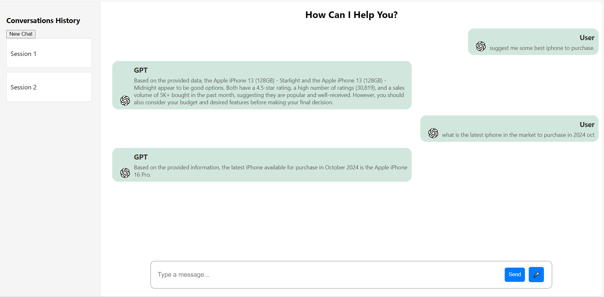

<div align="center">
    <h1>🛠️ SmartBuddy: Personal Assistant Chatbot 🤖</h1>
</div>

---

### 📜 Introduction

**SmartBuddy** is a Personal Assistant Chatbot designed to assist users with various tasks based on their instructions. It can access external APIs to provide real-time information and demonstrates **tool-use** capabilities for enhanced functionality, including interaction with LLMs (Large Language Models).

---

### 📂 Project Structure
- **Backend**: Contains the server-side code and tool-agent scripts.
- **Frontend**: Built with React for a responsive, interactive user interface.
- **Images**: Contains visuals and screenshots for demo purposes.

---

### ⚙️ Installation

1. **Clone the repository** and navigate to the project folder:
    ```bash
    git clone https://github.com/manishhnnegi/SmartBuddy.git
    cd SmartBuddy
    ```

2. **Install required packages** (Python >= 3.9):
    ```bash
    pip install -r requirements.txt
    ```

---

### 🚀 Start the Application

1. **Backend Setup**
   - Navigate to the backend directory:
     ```bash
     cd Backend
     ```
   - Run the retrieval agent:
     ```bash
     python retrival_agent_chat.py
     ```
   - Start the Tool Agent server:
     ```bash
     python tool_agent.py
     ```

2. **Frontend Setup**
   - In the frontend directory, start the React server:
     ```bash
     npm start
     ```

---

### 🎨 Demo UI in React

Below is a screenshot of **SmartBuddy’s** chat interface built with React.

<br>
<div align="center">
    
</div>
<br>

---

### 📝 Git Commands

Basic git workflow:
```bash
git add .
git commit -m "description of changes"
git push origin main
