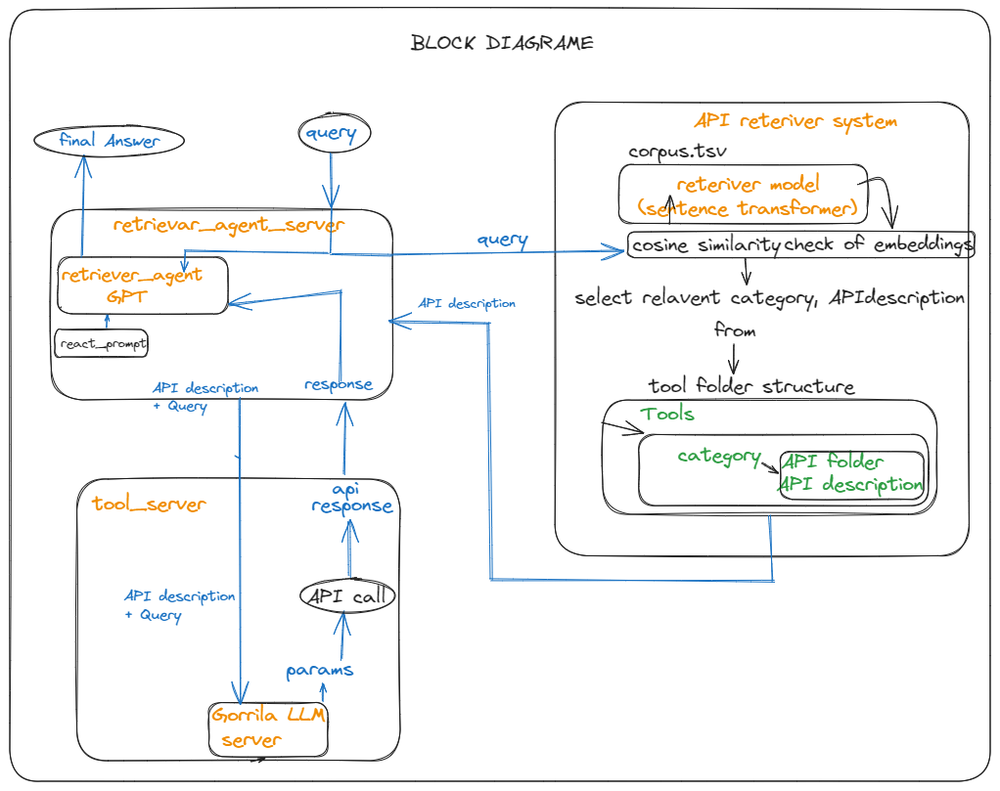

<div align="center">
    <h1>🛠️ SmartBuddy: Assistant Agent Bot 🤖</h1>
</div>

---

### 📜 Introduction

**SmartBuddy** is a Assistant Agent Bot designed to assist users with various tasks based on their instructions. It can access external APIs to provide real-time information and demonstrates **tool-use** capabilities for enhanced functionality, including interaction with LLMs (Large Language Models).

This assistant currently integrates the following external APIs:

1. **E-commerce API**: Retrieve product information and manage orders.
2. **Wikipedia Search API**: Look up information from Wikipedia.
3. **Translation API**: Translate text to various languages.
4. **Weather API**: Fetch up-to-date weather information.

**Memory Integration**: Utilizing LangChain’s Generative Agent Memory, this project is based on the paper ["Generative Agents: Interactive Simulacra of Human Behavior"](https://arxiv.org/abs/2304.03442), enhancing the agent’s memory and user interaction.

---

### 🎨 Demo UI in React

Below is a screenshot of **SmartBuddy’s** chat interface built with React.

<br>
<div align="center">
    
</div>
<br>


---

### Architecture Overview

Below is a high-level block diagram illustrating the interaction amoung retrival agent server , API reteriver server and tool server:

<br>
<div align="center">
    
</div>
<br>

---

### 📂 Project Structure
- **Backend**: Contains the server-side code and tool-agent scripts.
- **Frontend**: Built with React for a responsive, interactive user interface.
- **Images**: Contains visuals and screenshots for demo purposes.

---

### ⚙️ Installation

1. **Clone the repository** and navigate to the project folder:
    ```bash
    git clone https://github.com/manishhnnegi/SmartBuddy.git
    cd SmartBuddy
    ```

2. **Install required packages** (Python >= 3.9):
    ```bash
    pip install -r requirements.txt
    ```

---

### 🚀 Start the Application

1. **Backend Setup**
   - Navigate to the backend directory:
     ```bash
     cd Backend
     ```
   - Run the retrieval agent:
     ```bash
     python retrival_agent_chat.py
     ```
   - Start the Tool Agent server:
     ```bash
     python tool_agent.py
     ```
   - Within `data/toolenv/`, ensure the following structure:
      ```
      ├── /tools/
      │  ├── /eCommerce/
      │  │  ├── search.json
      │  │  ├── /search/
      │  │  │  └── api.py
      │  │  └── ...
      │  ├── /Translation/
      │  │  ├── translate.json
      │  │  ├── /translate/
      │  │  │  └── api.py
      └── ...
      ```

2. **Frontend Setup**
   - In the frontend directory, start the React server:
     ```bash
     npm start
     ```

---

### 📝 Git Commands

Basic git workflow:
```bash
git add .
git commit -m "description of changes"
git push origin main
